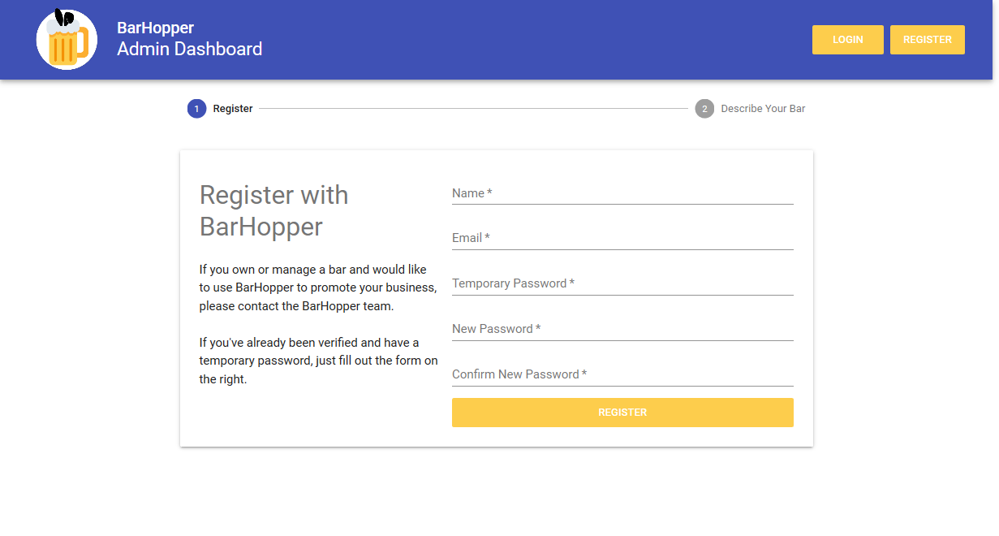
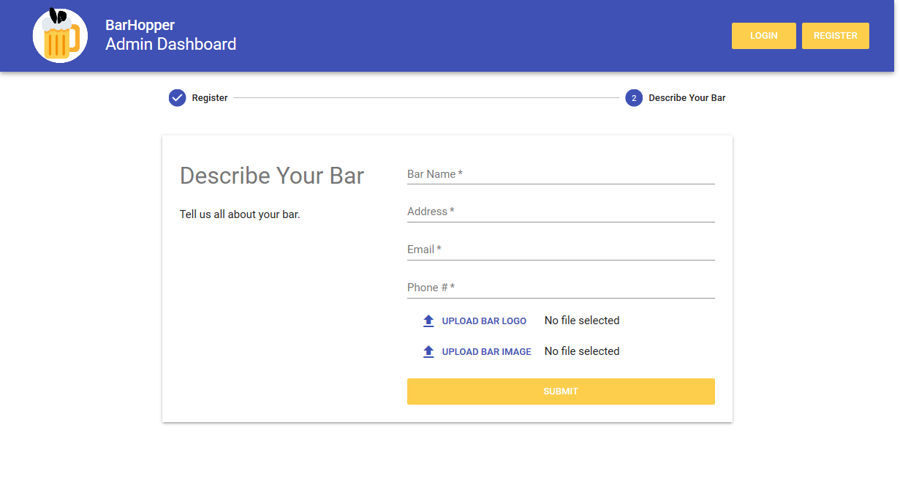
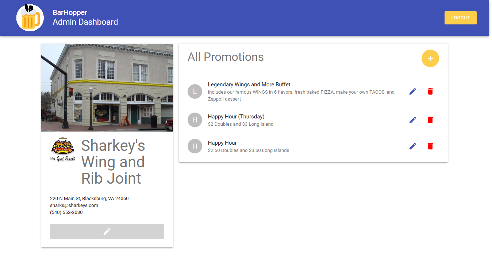
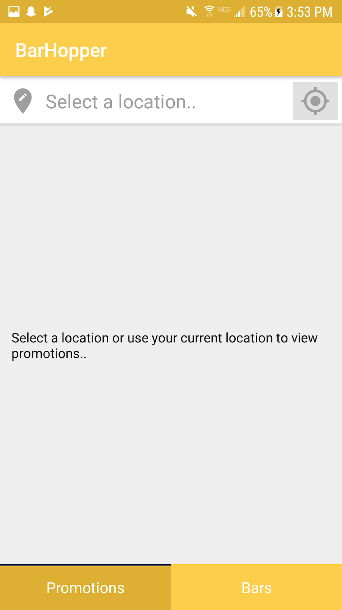
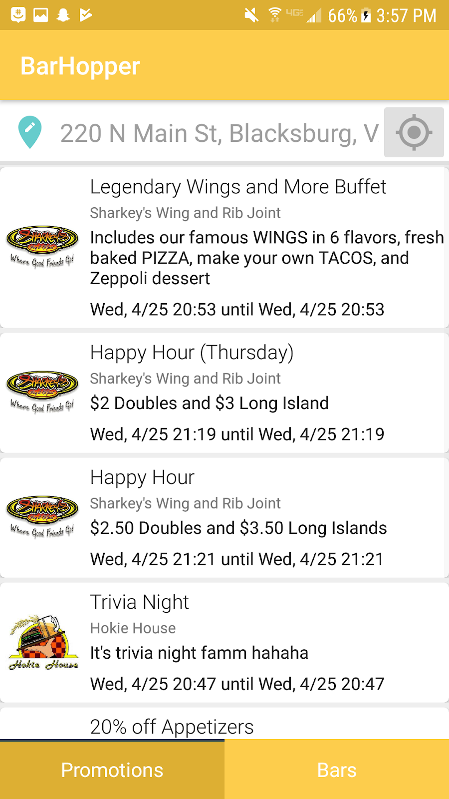
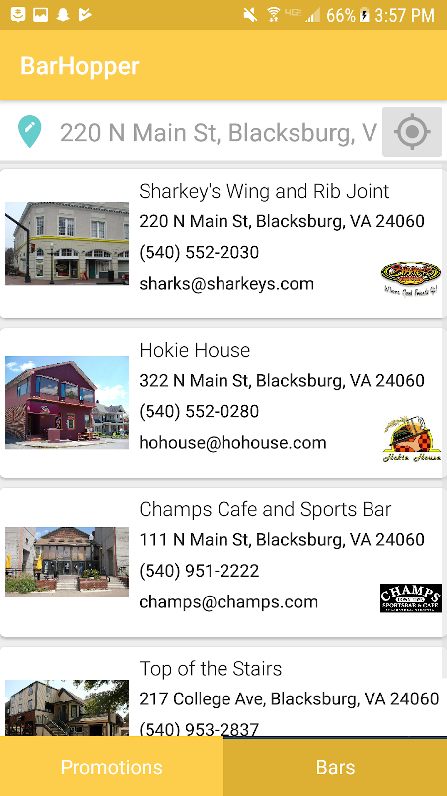

# BarHopper

BarHopper is a cross-platform product for bar owners to advertise their promotions using a web dashboard, and for bar-goers to view promotions near their location using the Android and iOS apps. 

## Contributors

Will Campbell - Android and BarHopper API

Cameron Byers - iOS

Taylor Quinn - UX

Sophia Scheikl - UX

This repro contains the web dashboard for bar owners to manage their promotions. 

Both the web dashboard and user apps consume the [BarHopper API](https://github.com/burkeboston1/barhopperapi), a Node server written in Express.js and MongoDB. 

## Screenshots

